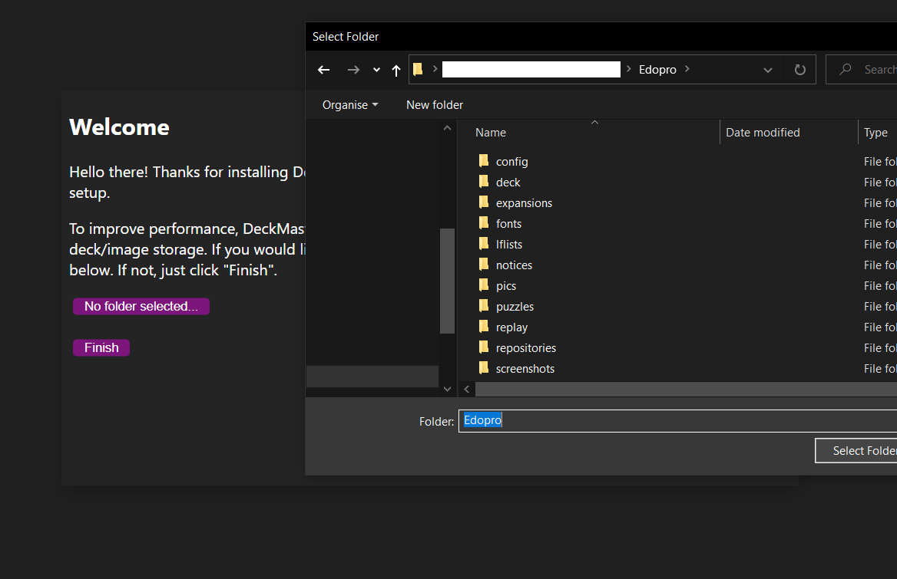

# First Use of DeckMaster

The first time you launch DeckMaster, you'll see a welcome screen. 
This screen is the setup, and allows you to optionally link YGOPro/EDOPro to the app. 

## Linking YGOPro/EDOPro

If you wish to link YGOPro/EDOPro to the app, click on the button and navigate to the application's folder. 
You can change this later in settings. 

> HINT: The folder is the one containing `YGOPro.exe` or `EDOPro.exe`

Click `Finish` and begin using DeckMaster.

## That's all folks

You are now free to enjoy DeckMaster and the features it offers. 
More documentation is available for each feature, if you need it. 
